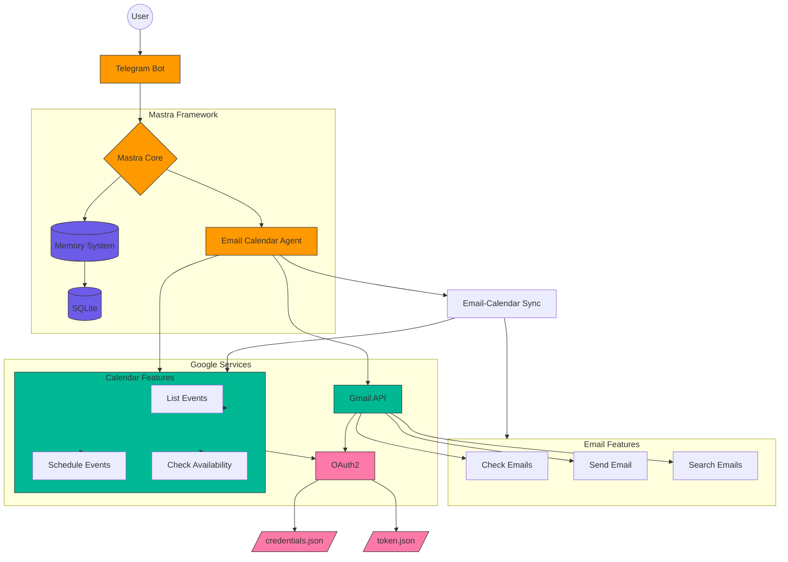

# Project Architecture

```mermaid
flowchart TB
    %% User Layer
    User((User)) --> TBot[Telegram Bot]
    TBot --> Core{Mastra Core}

    %% Framework Layer
    subgraph Mastra[Mastra Framework]
        Core --> Agent[Email Calendar Agent]
        Core --> Memory[(Memory System)]
        Memory --> DB[(SQLite)]
    end

    %% Google Integration
    subgraph Google[Google Services]
        Agent --> Gmail[Gmail API]
        Agent --> Calendar[Calendar API]
        Gmail & Calendar --> Auth[OAuth2]
    end

    %% Data Files
    Auth --> Creds[/credentials.json/]
    Auth --> Token[/token.json/]

    %% Email Features
    subgraph Email[Email Features]
        Gmail --> Read[Check Emails]
        Gmail --> Send[Send Email]
        Gmail --> Search[Search Emails]
    end

    %% Calendar Features
    subgraph Calendar[Calendar Features]
        Calendar --> List[List Events]
        Calendar --> Schedule[Schedule Events]
        Calendar --> Check[Check Availability]
    end

    %% Integration
    Agent --> Sync[Email-Calendar Sync]
    Sync --> Email
    Sync --> Calendar

    %% Styles
    classDef primary fill:#ff9900,stroke:#333
    classDef api fill:#00b894,stroke:#333
    classDef storage fill:#6c5ce7,stroke:#333
    classDef auth fill:#fd79a8,stroke:#333

    class TBot,Core,Agent primary
    class Gmail,Calendar api
    class Memory,DB storage
    class Auth,Creds,Token auth
```
